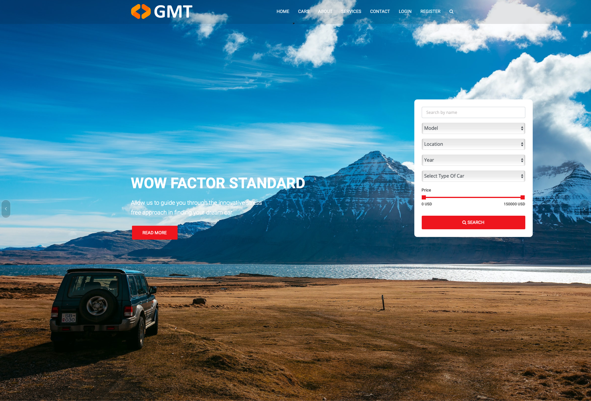
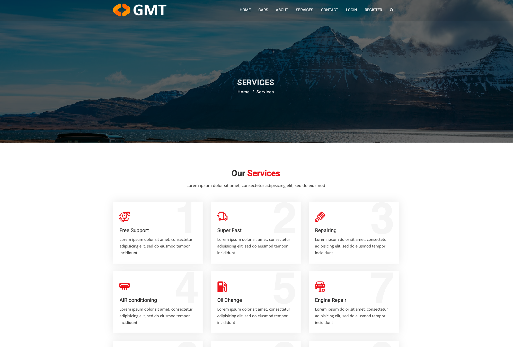
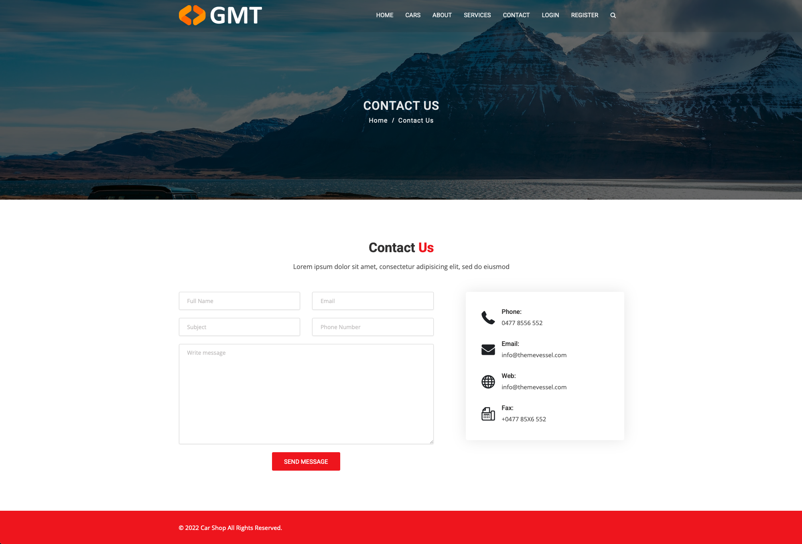

# Car Shop

A Django-based used car marketplace developed in 2022. This project provides a comprehensive platform for car listings, search, and appointment scheduling with a modern, responsive design.

## Features

- Car listings with detailed information and high-quality images
- Advanced search and filtering capabilities
- User authentication and profile management
- Appointment scheduling system
- Contact form with email notifications
- Admin dashboard for content management
- Responsive design for all devices

## Screenshots

### Home Page


### Services Page


### Contact Page


## Tech Stack

- Python 3.x
- Django 4.0.6
- PostgreSQL
- Bootstrap
- jQuery
- CKEditor for rich text editing
- Django AllAuth for authentication
- WhiteNoise for static files

## Quick Start

1. Clone and setup:
```bash
git clone [your-repository-url]
cd Car-Shop
python -m venv venv
source venv/bin/activate  # Linux/Mac
# or
venv\Scripts\activate  # Windows
pip install -r requirements.txt
```

2. Configure database:
- Install PostgreSQL
- Create database
- Update database settings in `carshop/settings.py`
- Update email settings in `carshop/settings.py`

3. Run migrations:
```bash
python manage.py migrate
python manage.py createsuperuser
python manage.py runserver
```

4. Access:
- Frontend: http://localhost:8000
- Admin: http://localhost:8000/admin

## Project Structure

```
Car-Shop/
├── carshop/          # Project settings
├── pages/            # Main app
├── cars/             # Car listings app
├── accounts/         # User authentication
├── contacts/         # Contact form handling
├── static/           # Static files
├── templates/        # Templates
└── manage.py         # Django management script
```

## Author

GenKnot

## License

MIT License 